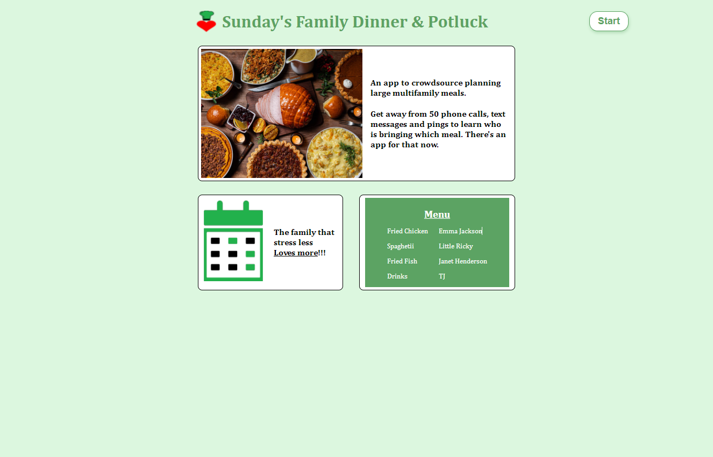
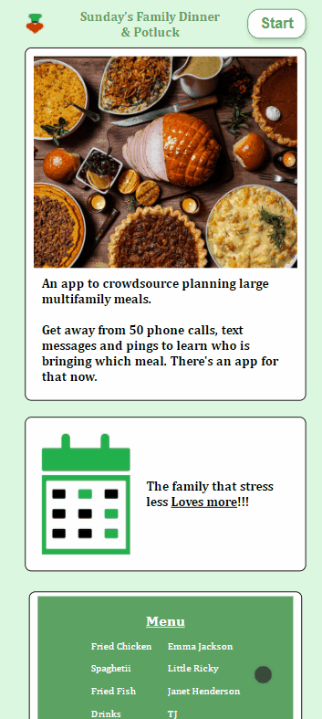
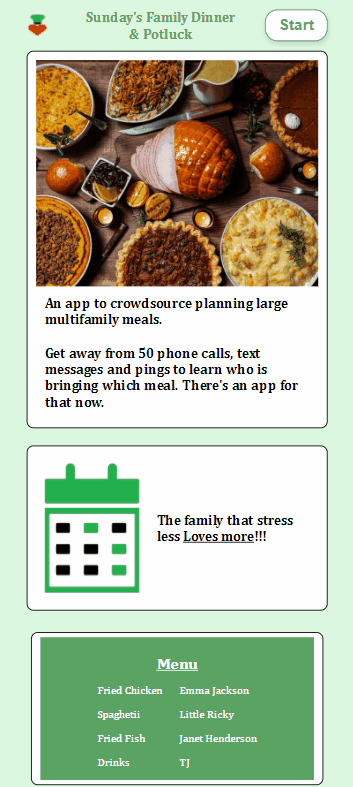

# Sunday's Family Dinner and Potluck w/ React, Cypress.io

### The challenge

Every delicious spread of food with friends, co-workers, and family is always preceded by complicated meal planning. **I want to build an app to crowdsource planning large multifamily meals.** 

Get away from 50 phone calls, text messages, and pings to learn who is bringing which meal. There's an app for that now.

### GIFs of app in use
**Event organizer creating an event**

**User applying a code to add an item to a group event**

### Production/Host Site

https://jcsmileyjr.github.io/dinner-potluck/

### Blog Posts
- [Day 1: Building a multi-family meal planning web service](https://dev.to/jcsmileyjr/day-1-building-a-multi-family-meal-planning-web-service-50i)
- [Under Construction: Development journy of a multi-famly meal planning app, v1]()

### How to run in development(Windows with NPM)
1. Clone the repo.
2. Open a terminal and navigate to the dinner folder
3. Type npm install
4. When finish, type npm start

### How to run integration tests (Windows)
1. In your terminal, get to the dinner folder. 
2. Run the command, "npx cypress open".
3. A broswer should open up with several tests
4. Either click on the tests one by one OR look to the far right corner to tap the "Run 4 integration specs"

### Built with
- Integration testing with Cypress.io
- React
- Semantic HTML5 markup
- CSS custom properties
- CSS Grid & CSS Flexbox
- Mobile-first workflow
- Javascript functionality like the Fetch API to grab data
- Production app hosted with GitHub Pages

## Author
- Website - [JC Smiley](https://www.jcsmileyjr.com)
- Twitter - [@JCSmiley4](https://twitter.com/JCSmiley4)
- LinkedIn - [jcsmileyjr](https://www.linkedin.com/in/jcsmileyjr/)
